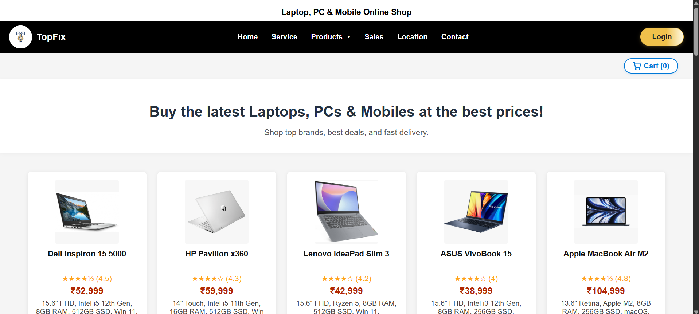
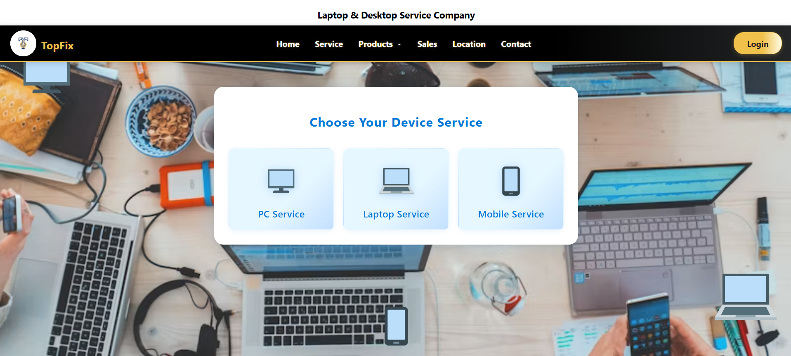
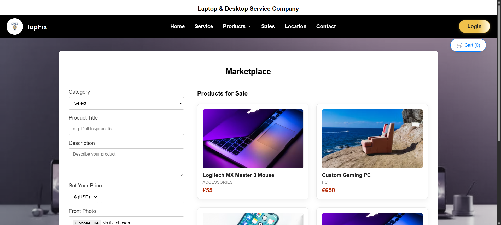
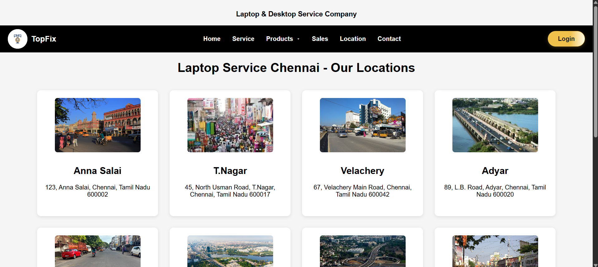
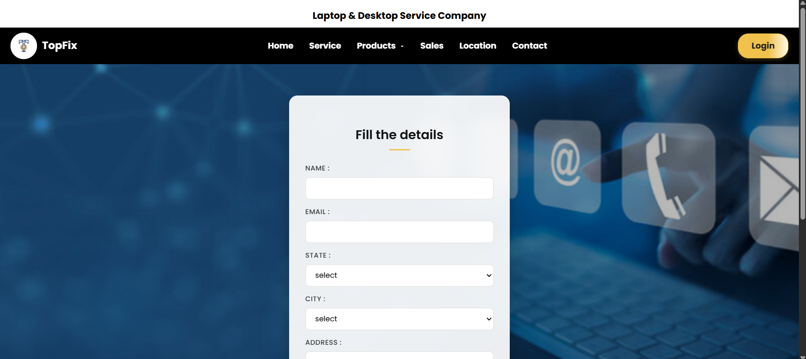

# 🛠️ TopFix

<p align="center">

### Electronic Service & Sales Platform

A responsive frontend web application that allows users to browse electronic products, book repair services, sell used devices, locate nearby service centers, and contact customer support through a modern and intuitive interface.

---

**HTML5 • CSS3 • JavaScript • Responsive Design • Electronic Services**

</p>

---

# 📌 Project Summary

TopFix is a responsive frontend web application developed to simplify electronic product sales and repair services in one platform. The website provides users with an easy way to explore products, request repair services, sell used electronic devices, locate nearby service centers, and contact customer support.

Designed with a clean and responsive interface, TopFix focuses on delivering a smooth user experience across desktops, tablets, and mobile devices while demonstrating modern frontend development practices using HTML, CSS, and JavaScript.

---

# ✨ Features

- 🏠 Responsive Home Page
- 🛍️ Browse Electronic Products
- 🔧 Book Device Repair Services
- 💻 Sell Used Laptops and Mobile Phones
- 📍 Locate Nearby Service Centers
- 📞 Contact Customer Support
- 🔐 User Login Interface
- 🛒 Shopping Cart UI
- 📱 Fully Responsive Design

---

# 🛠️ Technologies Used

| Technology | Purpose |
|------------|---------|
| HTML5 | Website Structure |
| CSS3 | Styling & Responsive Layout |
| JavaScript | Interactive Features & User Experience |

---

# 🔄 Website Workflow

```text
Home Page
     │
     ▼
Browse Products
     │
     ▼
Select Required Service
     │
     ▼
Book Repair / Sell Device
     │
     ▼
Locate Service Center
     │
     ▼
Contact Support
     │
     ▼
Login / Cart
     │
     ▼
End
```

---

# 📂 Project Structure

```text
TopFix
│
├── homepage.html
├── product.html
├── service.html
├── sell(1).html
├── location.html
├── contact.html
├── login1.html
├── cart.html
│
├── homepage/
├── product/
├── service/
├── sell/
├── location/
├── contact/
│
├── screenshots/
│   ├── Home.png
│   ├── Products.png
│   ├── Service.png
│   ├── Sell.png
│   ├── Location.png
│   └── Contact.png
│
└── README.md
```

---

# 📄 Pages

## 🏠 Home Page

- Welcome section
- Navigation menu
- Featured services
- Brand highlights
- Responsive layout

---

## 🛍️ Product Page

- Laptop collection
- Mobile phones
- Accessories
- Product cards

---

## 🔧 Service Page

- Repair service booking
- Device repair form
- Customer information

---

## 💻 Sell Page

- Sell used electronic devices
- Device details submission
- Easy selling process

---

## 📍 Location Page

- Nearby service center listings
- Easy navigation

---

## 📞 Contact Page

- Contact form
- Customer enquiry section

---

## 🔐 Login Page

- Secure login interface
- User authentication layout

---

## 🛒 Cart Page

- Selected product summary
- Purchase review interface

---

# 📸 Screenshots

## 🏠 Home Page


---

## 🛍️ Products Page



---

## 🔧 Service Page



---

## 💻 Sell Page



---

## 📍 Location Page



---

## 📞 Contact Page



---

# 🚀 Future Enhancements

- 👤 User Registration
- 🛒 Complete Shopping Cart Functionality
- 💳 Online Payment Gateway
- 📦 Order Tracking System
- 🛠️ Admin Dashboard
- 🗄️ MySQL Database Integration
- ☕ Java Spring Boot Backend
- 📧 Email Notifications
- 🔒 Secure Authentication
- ⭐ Product Reviews & Ratings

---

# 🎯 Learning Outcomes

- Built a responsive multi-page website
- Improved HTML5 semantic structure
- Practiced CSS Flexbox and Grid layouts
- Implemented JavaScript-based interactions
- Designed reusable UI components
- Enhanced responsive web design skills

---

# 👨‍💻 Author

**Jayaprasath M**

Computer Science Engineering Student

Panimalar Engineering College

---
